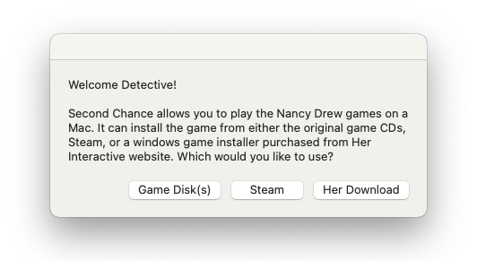

An app for running the pre-unity Nancy Drew video games on modern Macs. It (should hopefully) work for all the Nancy Drew games before "Midnight in Salem".

    

> [!WARNING]
> This project is still very new and there will be bugs. I've tried to make it as user friendly as possible but keep in mind there are still some rough edges. Please let me know if you run into any issues using it.

Want to play the Nancy Drew adventure games but you own a Mac and can't get them to run? Maybe like me you have fond memories of whiling away your childhood scoping out old mansions and questioning suspects. That's where Second Chance comes in. You tell it where to find your copy of one of the Nancy Drew games (either on CD, via Steam or downloaded from the Her Interactive website) and it will create a playable version of the game as a new app.

## How to Use

Once you've launched the app you should see a dialog like this:

Select the option the option for which ever form of the game installer that you own. (Note: the "Her Download" option only works with the Windows versions of the games downloaded from the Her Interactive website, ironic I know.)

Installing from CD is the most reliable method but unless you happen to have a copy of the original game CDs and a CD drive that works with your computer then this might not be an option for you.

If you go with the "Game Disk(s)" option you should see a pop up asking you to select your CD drive with the Nancy Drew installer disk loaded in it.

If you select the Steam option it may take a while but eventually you should hopefully see the login screen for the Steam app. Login then download the Nancy Drew title you want to play. After its installed fully quit the Steam app

## Troubleshooting

  
The audio sounds stuttery

  This may sound strange but do you have an external display plugged in? Try unplugging it and re-launching the app. There's a strange bug in macOS that can sometimes cause this.

  
Seeing a black screen when trying to play

  &&&&&&try windowing and full screening a couple of times

- Include fundraising campaign to get dev account to sign
- Fails to launch, worse case restart
- https://www.dosbox-staging.org/releases/macos/#apple-gatekeeper 

## Architecture
Second Chance is predominately constructed out of duct tape (Bash scripts) with some super glue here and there (AppleScript). It started as a simple script that I wrote just for myself to help automate the creation of a Wine wrapper for some of the Nancy Drew games. Over time the scope and complexity grew and grew but I haven't yet been able to justify the time for a full rewrite so sadly it remains mostly (some very overgrown) bash scripts with AppleScript for the GUI.

There's 2 main components, the game wrapper app and the second chance app.

### The Game Wrapper App
Or maybe "apps" plural is more applicable here since a new instance of the game wrapper app is created for each "wrapped" Nancy Drew game that the user decides to create. Each game wrapper app includes a copy of the [Wine engine](https://www.winehq.org/), the game files for the installed Nancy Drew game, and some scripts to coordinate the launching of the game + apply some per game fixes.

### The Second Chance App
This provides a user interface for constructing a wrapped game. The user tells it where it can find an installer for a Nancy Drew game and it will create an empty wrapper app then run the game installer and install the game inside the wrapper.

## Testing
If only 🥲

## Development
Good luck (and also thank you very much for considering helping out).

requirements
- platypus

## Thanks to
- cnc-ddraw